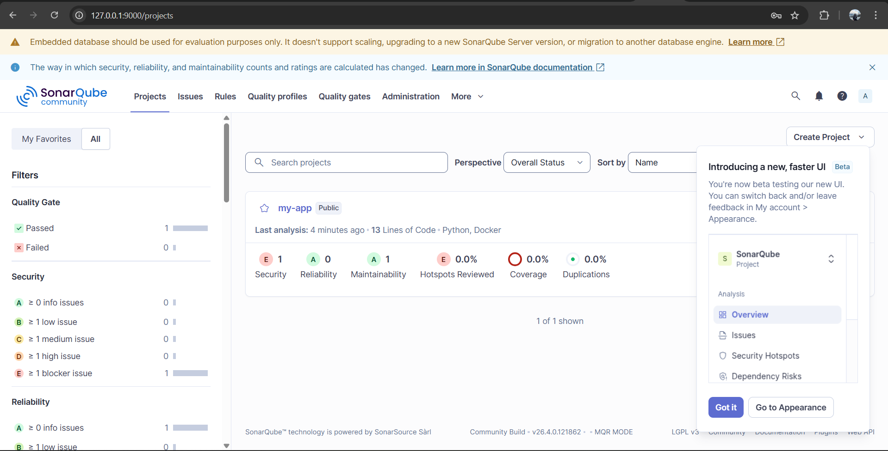
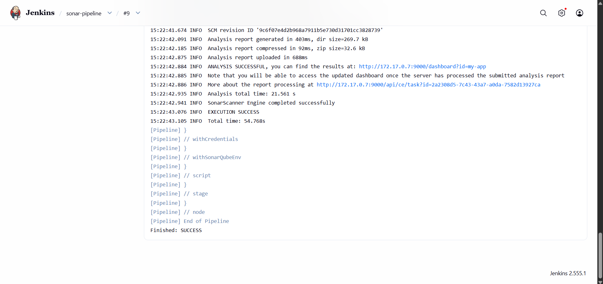
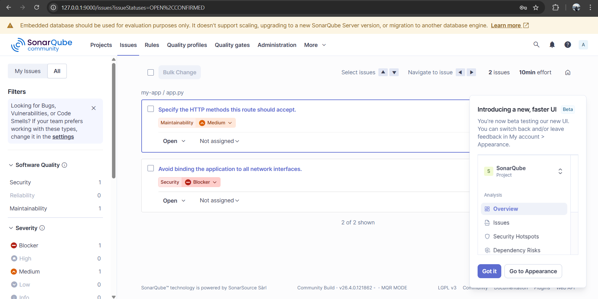
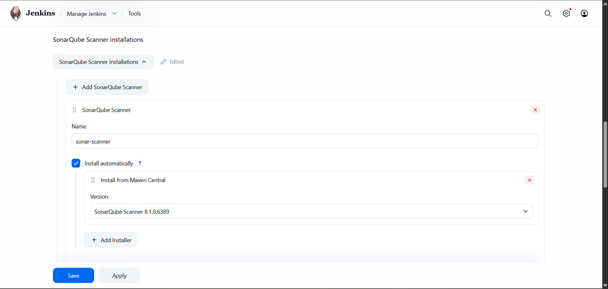

# Experiment 10: SonarQube — Static Code Analysis

**Name:** Akshay Kumar  
**Roll No:** R2142231012  
**SAP ID:** 500120477  
**Course:** Containerization and DevOps  

---

## Objective

To perform static code analysis using SonarQube to detect bugs, vulnerabilities, and code smells, and integrate it with Jenkins in a CI/CD pipeline.

---

## Theory

### Problem Statement

Manual code reviews are slow and unreliable. Bugs and vulnerabilities are often discovered late, increasing development cost.

### What is SonarQube?

SonarQube is an open-source tool used for static code analysis. It scans source code and detects:

- Bugs
- Security vulnerabilities
- Code smells
- Code duplication

### Key Terms

| Term | Meaning |
|------|---------|
| Quality Gate | Conditions code must pass to be considered acceptable |
| Bug | Code that behaves incorrectly at runtime |
| Vulnerability | A security flaw that can be exploited |
| Code Smell | Poor coding practice that hurts maintainability |
| Coverage | Percentage of code covered by tests |
| Duplication | Repeated blocks of code |

### Architecture

```
Code → Sonar Scanner → SonarQube Server → Dashboard
```

---

## Prerequisites

- Docker installed
- Jenkins running in Docker
- SonarQube running on port 9000

---

## Steps

### Step 1: Start SonarQube

Run the SonarQube container:

```bash
docker run -d -p 9000:9000 sonarqube
```

Verify the container is running:

```bash
docker ps
```

---

### Step 2: Open SonarQube Dashboard

Open your browser and navigate to:

```
http://localhost:9000
```

Login with default credentials:

- **Username:** `admin`
- **Password:** `admin`



---

### Step 3: Generate Token

- Go to **My Account → Security**
- Generate a new token and copy it — this will be used in Jenkins

---

### Step 4: Jenkins Setup

- Install the **SonarQube Scanner Plugin** in Jenkins
- Go to **Manage Jenkins → Configure System**
- Add the SonarQube server URL and credentials using the token generated above

---

### Step 5: Jenkins Pipeline

Create a pipeline with the following script:

```groovy
pipeline {
    agent any
    stages {
        stage('Clone Repo') {
            steps {
                git 'https://github.com/Kumaxshay/my-app-.git'
            }
        }
        stage('SonarQube Analysis') {
            steps {
                withSonarQubeEnv('sonar') {
                    sh '''
                    /var/jenkinshome/tools/hudson.plugins.sonar.SonarRunnerInstallation/sonar-scanner/bin/sonar-scanner \
                    -Dsonar.projectKey=my-app \
                    -Dsonar.sources=. \
                    -Dsonar.host.url=http://host.docker.internal:9000 \
                    -Dsonar.login=$SONARTOKEN
                    '''
                }
            }
        }
    }
}
```

---

### Step 6: Run the Pipeline

Click **Build Now** in Jenkins to trigger the pipeline.

The console output shows the SonarQube scanner running and sending results to the server:



---

### Step 7: View Analysis Results in SonarQube

After the build completes, open the SonarQube dashboard to view the full analysis:


View detected issues such as bugs, vulnerabilities, and code smells:



---

### Step 8: Jenkins Pipeline Result

Verify the pipeline completed successfully in Jenkins:



---

## Results

- Code was successfully analyzed using SonarQube
- Issues like bugs and vulnerabilities were detected and displayed on the dashboard
- Jenkins pipeline was integrated with SonarQube for automated analysis
- Automated code quality checking was achieved as part of the CI/CD workflow

---

## Conclusion

SonarQube improves code quality by detecting issues early in the development cycle. Integration with Jenkins enables automated analysis on every build, making development faster, safer, and more reliable.

---

## Folder Structure

```
project/
│── README.md
│── screenshots/
    │── issues.png
    │── console-output.png
    │── sonarqube-dashboard.png
    │── jenkins-success.png
```

---

## Best Practices

- Do not hardcode tokens — use environment variables
- Run scans on every commit via Jenkins triggers
- Fix issues immediately to avoid technical debt
- Set Quality Gates to block deployments on critical issues
- Maintain clean and readable code at all times

